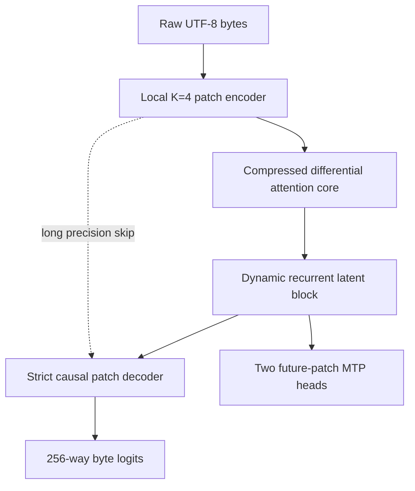

# StrataByte-7M

**A 7.13M-parameter hierarchical byte-level sparse recurrent language model designed for local CPU training and inference.**

StrataByte-7M operates directly on raw UTF-8 bytes. It combines learned byte-patch compression, low-rank differential attention, staggered multi-resolution context, sparse Mixture-of-Experts routing, recurrent latent computation, and multi-token prediction in one self-contained PyTorch implementation. A native PySide6 desktop interface provides dataset setup, training control, live metrics, generation, and checkpoint management.

> **Status:** research implementation. The architecture and complete training application are included; pretrained weights are not.

## Model summary

| Property | Default configuration |
|---|---:|
| Parameters | **7,132,032** |
| Vocabulary | 256 raw byte values |
| Patch size | 4 bytes |
| Latent width | 192 |
| Core depth | 3 blocks + 1 shared recurrent block |
| Attention heads | 8 staggered heads |
| Attention strides | 1, 2, and 4 patches |
| Query / KV ranks | 64 / 64 |
| Routed experts | 8, Top-2 by default |
| Shared experts | 1 per SMoE block, always active |
| MTP horizon | Next 2 patches |
| Precision | float32 or CPU bfloat16 |
| Primary target | Local CPU training and inference |

## Architecture



### Byte-level sandwich

The local encoder compresses every four byte embeddings into one latent patch using a strided 1D convolution plus a pooled residual. The global core processes the shorter patch sequence. The local decoder reconstructs autoregressive byte states using strict within-patch causal attention and cross-attention to the preceding global latent state. A direct encoder-to-decoder skip preserves fine byte detail.

### Compressed differential attention

Each head constructs two query/key states and one value state through separate low-rank query and KV bottlenecks:

```text
cQ  -> Q1, Q2
cKV -> K1, K2, V
```

The two causal attention distributions are subtracted using a learned, sigmoid-constrained multiplier initialized at 0.8:

```text
A = (softmax(Q1 K1ᵀ) - λ softmax(Q2 K2ᵀ)) / (1 - λ + 1e-6)
```

The result is multiplicatively gated per head. Eight staggered heads cover stride-1, stride-2, and all four stride-4 offsets while retaining strict block causality.

### Sparse recurrent core

Every feed-forward layer is replaced by:

- 8 routed SwiGLU experts;
- Top-2 token routing by default;
- 1 shared SwiGLU expert that is always active;
- Switch-style expert load balancing;
- router Z-loss stabilization.

A weight-shared recurrent core block can be repeated zero or more times. Training and inference can therefore use different latent computation depths without changing model weights.

### Multi-token prediction

Two auxiliary heads predict the next one and two complete byte patches from each core state. During generation, both heads can draft up to eight bytes. The primary autoregressive decoder verifies those bytes before they are streamed to the interface.

## Training objective

StrataByte-7M uses the combined objective:

```text
Ltotal = Lbyte + 0.5 Lmtp + 0.01 Lbalance + 0.0001 Lrouter-z
```

The optimizer is AdamW with `(β1, β2) = (0.9, 0.98)`, weight decay `0.01`, global gradient clipping at `1.0`, a 200-step linear warmup, and cosine learning-rate decay.

## Quick start

Python 3.10 or newer is recommended.

```bash
python -m venv .venv
source .venv/bin/activate
python -m pip install -r requirements.txt
python stratabyte_7m.py --self-test
python stratabyte_7m.py
```

On Windows, activate the environment with:

```powershell
.venv\Scripts\activate
```

The application automatically downloads the 1.1 MB [TinyShakespeare byte corpus](https://raw.githubusercontent.com/karpathy/char-rnn/master/data/tinyshakespeare/input.txt) on first launch. If downloading is unavailable, a bundled public-domain fallback corpus keeps the training path operational.

## Desktop application

### Training

- Start, pause, resume, and stop controls
- Batch size, sequence length, peak learning rate, recurrence, Top-k, run length, and precision settings
- Live total loss, byte cross-entropy, MTP loss, routing metrics, gradient norm, learning rate, step, and byte tokens/second
- Native loss chart without plotting dependencies
- Atomic `.pt` checkpoint saves and safe weight loading

### Inference playground

- Streaming UTF-8 generation
- Temperature and Top-p sampling
- Adjustable recurrent thought depth from 0–5
- Optional two-head MTP drafting and verification
- Live byte throughput and accepted-draft count

## Verification

The included `--self-test` checks:

- forward and backward propagation;
- finite joint loss and gradients;
- global gradient clipping;
- strict future-byte causality;
- strict within-patch attention masking;
- recurrent execution;
- MTP proposal and verification paths;
- checkpoint serialization and restoration.

The self-test exercises a reduced CPU configuration. Full-size float32 or CPU bfloat16 behavior, desktop threading, sustained training, and throughput must be measured on the target machine rather than inferred from the reduced test.

## Repository layout

```text
StrataByte-7M/
├── .github/                        # CI, funding metadata, and issue form
├── stratabyte_7m.py                # Model, trainer, generator, and PySide6 GUI
├── requirements.txt                # PyTorch and PySide6 runtime dependencies
├── README.md                       # Architecture and model card
├── CHANGELOG.md                    # Factual release history
├── SUPPORT.md                      # Addresses and funded-direction rules
└── LICENSE                         # Apache-2.0 license
```

## Intended use

StrataByte-7M is intended for architecture research, CPU language-model experiments, educational inspection, and small-corpus local training. It is not a pretrained general assistant and should not be expected to produce coherent text until trained. TinyShakespeare is a pipeline demonstration dataset, not a claim of broad language capability.

## Current limitations

- No pretrained checkpoint is included.
- Generation recomputes the active context rather than using a persistent KV cache.
- MTP acceptance depends on training quality and sampling settings.
- The default corpus is intentionally small and is suitable for validation rather than general-purpose language modeling.
- Sparse expert routing is implemented transparently in PyTorch for portability, not through platform-specific fused kernels.

## Configuration

The `ModelConfig` dataclass exposes width, depth, low-rank bottlenecks, expert size, dropout, and recurrence limits. The shipped configuration stays inside the requested 3M–10M micro-model range while retaining every architectural component.

## Support development

Donations fund additional production. After confirmation, a donor may open the funded-direction issue template with the asset, exact network, public transaction hash, and requested model, training, benchmark, or interface direction. See [SUPPORT.md](SUPPORT.md) for attribution and safety rules.

## License

Apache-2.0. See [LICENSE](LICENSE).


## Install and run

```sh
chmod +x install.sh run.sh
./install.sh
./run.sh --help
```
